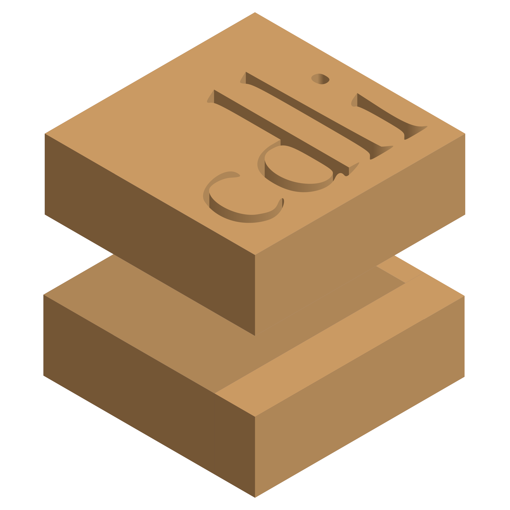

#  Framework API Client

Client for CDLI framework API.

  - [Install](#install)
  - [Getting started](#getting-started)
    - [Command-Line Interface](#command-line-interface)
    - [Programming Interface](#programming-interface)

## Install

A prerequisite for this client is [Node.JS](https://nodejs.org/en/) and a package
manager like [npm](https://npmjs.com), which usually comes with it.

    npm install -g https://github.com/cdli-gh/framework-api-client

Or install it locally into an existing project:

    npm install https://github.com/cdli-gh/framework-api-client

Alternatively, the command can be run with [npx](https://www.npmjs.com/package/npx):

    npx cdli-api-client --help

## Getting started

Right now, the client only supports a basic operation: exporting parts of the
database as linked data (or specifically N-Triples). The parts that can be
chosen are the types of entities in the catalogue, such as artifacts, materials,
proveniences, inscriptions and periods.

### Command-Line Interface

    cdli [command]

    Commands:
      cdli export  Export catalog and text data

    Options:
      --version          Show version number                               [boolean]
      --host, -h         Host URL to use for API calls
                             [string] [default: "https://cdli.mpiwg-berlin.mpg.de/"]
      --format, -f       File format
                      [choices: "ndjson", "csv", "tsv", "ntriples", "bibtex", "atf"]
      --output-file, -o  Output file (outputs to stdout by default)
      --help             Show help                                         [boolean]

#### Export

    cdli export

    Export catalog and text data

    Options:
      --version          Show version number                               [boolean]
      --host, -h         Host URL to use for API calls
                             [string] [default: "https://cdli.mpiwg-berlin.mpg.de/"]
      --format, -f       File format
                      [choices: "ndjson", "csv", "tsv", "ntriples", "bibtex", "atf"]
      --output-file, -o  Output file (outputs to stdout by default)
      --help             Show help                                         [boolean]
      --entities, -e     Which types of entities to fetch
            [array] [choices: "archives", "artifacts", "artifactsExternalResources",
                "artifactsMaterials", "collections", "dates", "dynasties", "genres",
      "inscriptions", "languages", "materials", "materialAspects", "materialColors",
                     "periods", "proveniences", "publications", "regions", "rulers"]

So to export place-related entities from a locally-running framework instance you
could do this:

    cdli export \
      --host http://localhost:2354/ \
      --entities archives proveniences regions \
      --output-file places.nt

### Programming Interface

```js
const CDLI = require('cdli-api-client')

const client = new CDLI.Client('http://localhost:2354/')

// process logging
client.on('log', msg => process.stderr.write(msg))

client.export(['archives', 'proveniences', 'regions' ], 'places.nt')
    .then(entities => {
        for (const { status, reason } of entities) {
            if (status === 'rejected') {
                console.error(reason)
            }
        }
    })
```
